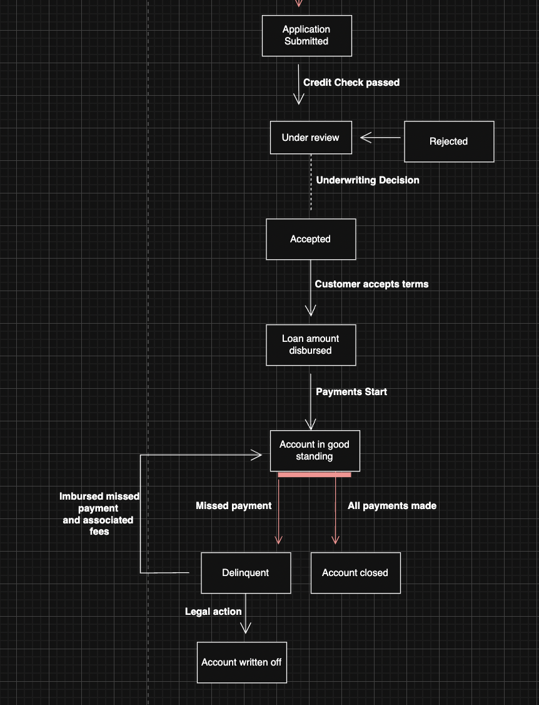

# Citi ICG Technology Software Development Job Simulation (Forage)

## Project Overview

This repository contains my completed job simulation for the Citi Institutional Clients Group (ICG) Technology Software Development program, hosted on Forage (July 2025). The simulation involved tackling real-world inspired tasks to improve Citi’s loan management system and enhance stock market risk reporting. The project demonstrates my ability to combine software engineering, data analysis, and research to deliver impactful solutions in a financial technology context.

---

## Features & Deliverables

- **UML State Diagram:** Modeled the loan management process to clarify system states and transitions.
- **Machine Learning Proposal:** Researched and recommended ML approaches for credit risk assessment, including data requirements, model selection, and risk analysis.
- **Java Stock Market Risk Visualization Tool:** Developed an internal JavaFX application to visualize real-time stock market risk using live Dow Jones Industrial Average data.

---

## Loan Management Process (UML State Diagram)



---

## Machine Learning Proposal: Credit Risk Assessment

**Objective:** Automate and enhance Citi’s credit risk assessment using machine learning to improve decision speed, accuracy, and portfolio quality.

**Key Data Requirements:**

- Customer demographics (age, gender, marital status, residence, employment)
- Financials (income, debt-to-income ratio, assets)
- Credit history (score, length, past loans)
- Loan details (amount, term, purpose, rate)
- Behavioral data (digital footprint, payment/spending patterns)

**Recommended Model:**

- **Random Forest (Ensemble of Decision Trees)**
  - High accuracy, handles complex/nonlinear data
  - Robust to overfitting, provides feature importance
  - Trade-offs: Less interpretable, higher memory usage, requires careful tuning

**Risks & Considerations:**

- Data quality and completeness are critical
- Potential for bias/fairness issues in historical data
- Model interpretability for stakeholders

**Next Steps:**

- Collect and clean relevant data
- Prototype and benchmark multiple models (Random Forest, Logistic Regression, etc.)
- Implement bias mitigation and interpretability tools

---

## Java Stock Market Risk Visualization Tool

**Purpose:**

- Real-time visualization of Dow Jones Industrial Average (DJIA) price trends
- Supports risk monitoring and rapid decision-making for Citi’s internal teams

**Features:**

- Fetches live DJIA data every 5 seconds
- Displays price trends on an interactive JavaFX line chart
- Status updates for latest price and data fetch state

**How to Run:**

1. Ensure Java and JavaFX are installed
2. Build and run the project using Gradle:
   ```sh
   ./gradlew run
   ```
3. The application window will display real-time DJIA price updates

---

## Skills Demonstrated

- **Java (JavaFX, concurrency, API integration)**
- **UML modeling (state diagrams)**
- **Machine learning research & proposal writing**
- **Real-time data visualization**
- **Financial technology domain knowledge**
- **Technical communication & documentation**

---

## Repository Structure

```
citi-StockCheck/
├── app/
│   └── src/main/java/org/example/App.java   # JavaFX stock risk tool
├── citiSWELoanChart.png                     # UML state diagram
├── README.md                                # Project documentation
├── gradle/                                  # Gradle build files
├── gradlew, gradlew.bat                     # Gradle wrappers
└── ...
```

---

**Contact:** For questions or collaboration, please reach out via LinkedIn or email.
